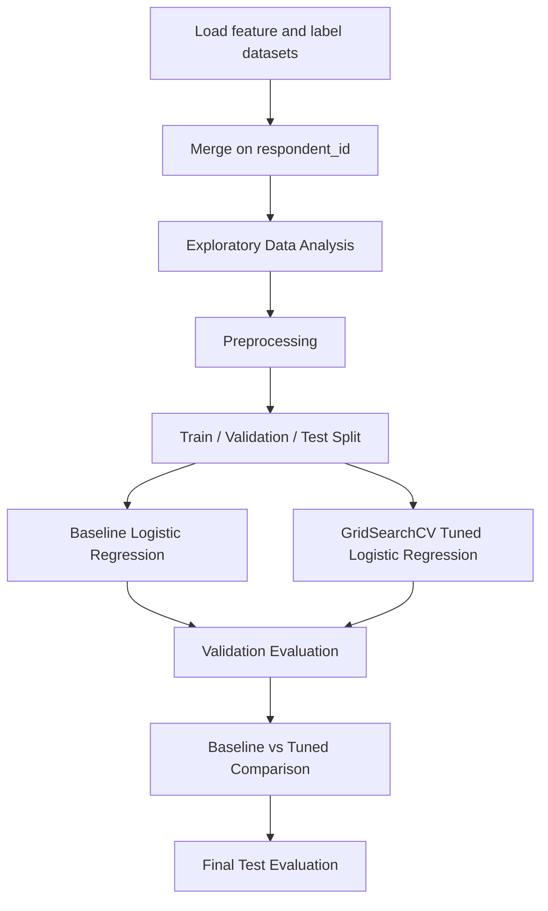
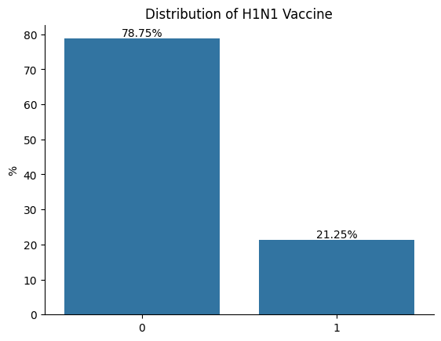
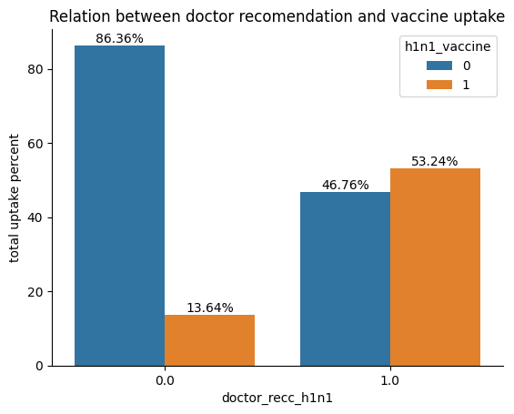
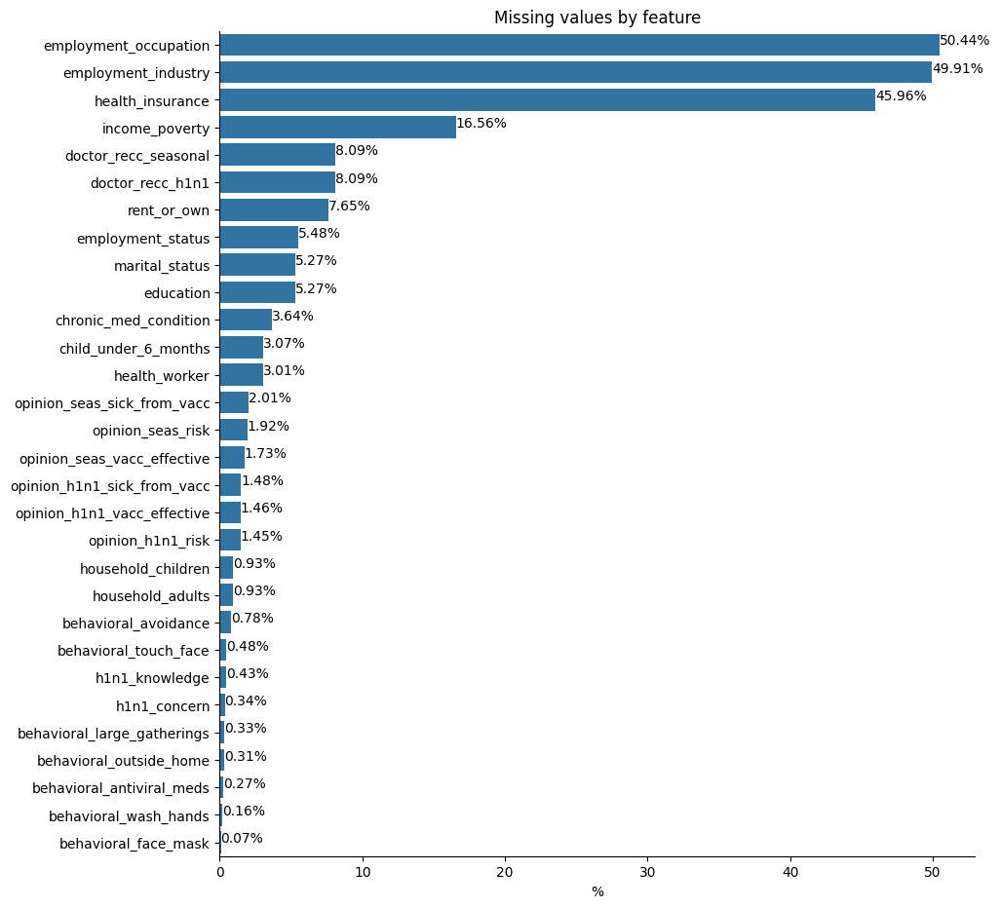

# 💉 Flu Shot Vaccine Prediction with Logistic Regression

> End-to-end machine learning project for predicting **H1N1** and **seasonal flu vaccine uptake** using structured survey data and **Logistic Regression**.

---

## 📌 Overview

This project explores whether a respondent is likely to receive:

- **H1N1 vaccine**
- **Seasonal flu vaccine**

The repository covers the full workflow of a supervised machine learning project, including:

- data loading and merging
- exploratory data analysis
- preprocessing
- train / validation / test split
- baseline modelling
- hyperparameter tuning with **GridSearchCV**
- final evaluation on unseen data

The goal was not only to build predictive models, but also to evaluate how well a linear classification approach performs on a real multilabel vaccination dataset.

---

## 🎯 Business Problem

Vaccination campaigns are more effective when outreach can be prioritised towards people who are less likely to get vaccinated on their own.

A model like this can support decision-making by helping identify groups that may require:

- earlier communication
- targeted reminders
- educational interventions
- better campaign resource allocation

In this project, I used **Logistic Regression** to estimate vaccine uptake likelihood for two binary targets.

---

## 🧠 Project Workflow



---

## 🗂️ Dataset

**Source:** [DrivenData - Flu Shot Learning: Predict H1N1 and Seasonal Flu Vaccines](https://www.drivendata.org/competitions/66/flu-shot-learning/data/)

Files used in this repository:

- `data/training_set_features.csv`
- `data/training_set_labels.csv`

The datasets were merged using `respondent_id`.

---

## 🛠️ Tech Stack

- **Python**
- **Pandas**
- **NumPy**
- **Matplotlib**
- **Seaborn**
- **Scikit-learn**
- **Jupyter Notebook**

---

## ⚙️ Methodology

### 1. Data Preparation
- Loaded and merged the feature and label datasets
- Created a modelling copy of the original dataframe
- Removed highly incomplete categorical features:
  - `employment_industry`
  - `employment_occupation`
- Removed `respondent_id` from the modelling dataset

### 2. Exploratory Data Analysis
The project includes:
- **5 univariate visualisations**
- **5 grouped / complex visualisations**

These charts helped identify:
- class imbalance
- missing value concentration
- behavioural and demographic patterns
- variables associated with vaccine uptake

### 3. Preprocessing
- **Categorical missing values** → most frequent imputation
- **Numerical missing values** → median imputation
- **Categorical encoding** → OneHotEncoder
- **Numerical scaling** → StandardScaler
- **Split strategy**:
  - 60% train
  - 20% validation
  - 20% test
- Stratification applied using `h1n1_vaccine`

### 4. Modelling
Two separate models were trained:
- one for `h1n1_vaccine`
- one for `seasonal_vaccine`

For each target:
- **Baseline Logistic Regression**
- **Tuned Logistic Regression with GridSearchCV**

### 5. Hyperparameter Tuning
The tuned models were optimised using:
- `C`
- `penalty`
- `solver`

The main tuning metric was **ROC-AUC**.

---

## 🤖 Why Logistic Regression?

Logistic Regression was chosen because it is:

- effective for binary classification
- interpretable
- computationally efficient
- suitable for structured tabular data
- strong as a baseline for probability-based classification tasks

It is also a good fit when the objective includes evaluating class probabilities with **ROC-AUC**.

---

## 📊 Key Visual Insights

### H1N1 target distribution


This chart highlights that the **H1N1 target is more imbalanced**, which makes metrics such as **ROC-AUC** and **F1-score** more informative than accuracy alone.

### Doctor recommendation vs H1N1 uptake


Doctor recommendation appears strongly associated with H1N1 vaccination uptake, suggesting that behavioural and trust-related features may be important predictors.

### Missing values by feature


Missingness is not uniformly distributed across the dataset, which justifies the use of **imputation** and **amputation** during preprocessing.

---

## 📏 Evaluation Metrics

The models were evaluated using:

- **ROC-AUC**
- **F1-score**
- **Precision**
- **Recall**
- **Accuracy**
- **Classification Report**

### Why these metrics?
- **ROC-AUC** evaluates ranking quality using probabilities
- **F1-score** balances precision and recall
- **Precision** shows how reliable positive predictions are
- **Recall** shows how many real positive cases were captured
- **Accuracy** provides an overall correctness view

---

## 🧪 Final Test Results

| Target | ROC-AUC | F1-score | Precision | Recall | Accuracy |
|--------|--------:|---------:|----------:|-------:|---------:|
| H1N1 Vaccine | 0.9310 | 0.6645 | 0.7075 | 0.6264 | 0.8656 |
| Seasonal Vaccine | 0.9883 | 0.9613 | 0.9290 | 0.9959 | 0.9635 |

---

## 🔍 Key Findings

- Logistic Regression performed strongly for both targets.
- The **seasonal vaccine** target achieved **very high and stable performance**.
- The **H1N1** target was more challenging, especially in capturing positive cases.
- Hyperparameter tuning produced **only marginal improvements** over baseline.
- Even so, the tuned models remained **stable across validation and test sets**, suggesting good generalisation.

---

## 📁 Repository Structure

```bash
vaccine_prediction_ml_project/
│
├── assets/                     # exported charts and visual assets
├── data/                       # raw dataset files
├── src/
│   └── flu_shot_logistic_regression.ipynb     # main notebook
├── requirements.txt
├── .gitignore
└── README.md
```

---

## ▶️ How to Run

### 1. Clone the repository

```bash
git clone https://github.com/enriquebruno12/vaccine_prediction_ml_project.git
cd vaccine_prediction_ml_project
```

### 2. Install dependencies

```bash
pip install -r requirements.txt
```

### 3. Launch Jupyter Notebook

```bash
jupyter notebook
```

Then open:

```bash
src/flu_shot_logistic_regression.ipynb
```

---

## 🔁 Reproducibility

This project uses the student ID as the `random_state` for reproducibility in:

- dataset splitting
- Logistic Regression training
- GridSearchCV configuration

---

## ⚠️ Limitations

Although the project achieved strong results, some limitations remain:

- only Logistic Regression was implemented
- the tuning grid was relatively narrow
- the classification threshold remained fixed at `0.5`
- no class weighting was applied
- no probability calibration was tested
- no external validation dataset was used

---

## 🚀 Future Improvements

Possible next steps include:

- threshold tuning instead of a fixed `0.5` cutoff
- class weighting for the H1N1 target
- probability calibration
- feature selection
- comparison with stronger models
- deployment as a simple API or Streamlit app

---

## 💼 What This Project Demonstrates

This repository highlights my ability to:

- build an end-to-end machine learning workflow
- work with structured tabular data
- perform preprocessing for mixed data types
- apply Logistic Regression in a classification setting
- tune models with GridSearchCV
- evaluate generalisation across validation and test sets
- communicate results clearly through charts and metrics

---

## 👤 Author

**Enrique Soares**

- GitHub: [enriquebruno12](https://github.com/enriquebruno12)
- LinkedIn: [enrique-bruno](https://www.linkedin.com/in/enriquebruno/)
